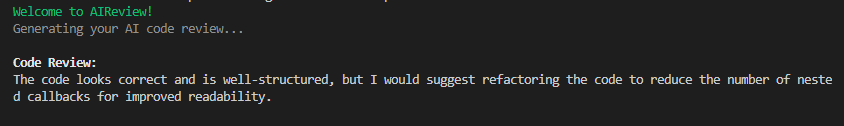
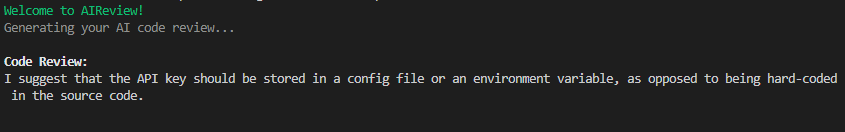

# AI Generated Code Review

## Description:
Generates a code review before commiting and pushing git changes using the OpenAI GPT-3 model. 

## Install and Usage:
- To install the package globally, use the following command:
```
npm i -g ai-review
```
- To use you own OpenAI key, use the following command in bash:
```
export OPENAI_API_KEY= XXXXXXXXX
```
- To use the tool, execute the following command inside the project that you want to make the review on:
```
ai-review
```

## Show cases: 


|- | Changes| Review  |
|--|--|--|
| 1|   |  |
|2|   |  |


